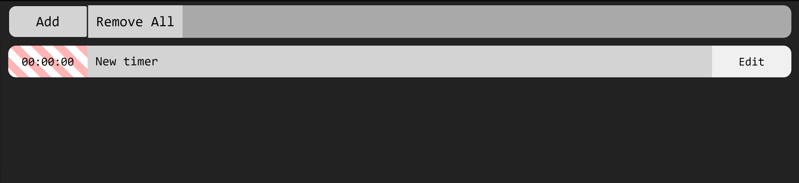
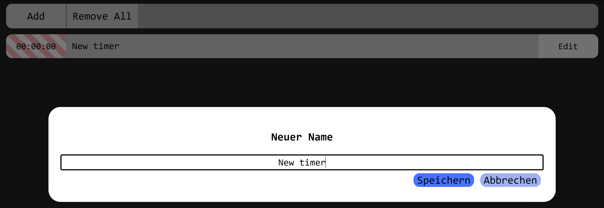
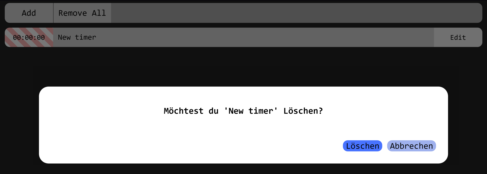

# DailyLog
One of Many Time Tracking Tools, but its look is just rudimentary.  

## Why is this on Github?
This Project was Created to make the Tool more Accessable to external Devices without the need of transfering Code.  

## What can it do?
> The Tool is currently live available at [https://ensnert.github.io/DailyLog/](https://ensnert.github.io/DailyLog/)  

The best features (i think) are  
- Timers store their state in the Browser's Localstorage with a Structure allowing the timer to Track the time, even if the Page / Tool is not open, **or the device is not running**. This can be of benefit, if the Computer Crashes or an Update must be made, with the Timer still Running.  
- Timer's Time can be modified in Minutes, even while the timer is running.

## How do i use it?

### Create a new Timer
Creation of a new Timer is as simple as pressing "Add" at the top of the Page.  

  

### Rename a Timer
Renaming the Timer can be done with the "Edit" button on each Timer.  

  

The dialog box autofocuses the inputbox for quick Editing.  
With the `Enter` Key, you can Save the input.  
With the `Esc` Key, you can close the Dialog without saving the changes.  

Special Features:  
- Editing the name of the Timer with the Postfix `+10` will grant 10 Minutes to the Timer.  
- This works also in reverse, `-10` will deduct 10 Miuntes from the Timer.  
- You can combine the Renaming of a Task with Modifying a Time to that timer. For example `[Ticket-1234] Support+60`, will rename the Timer to `[Ticket-1234] Support` and adds **1 Hour** to the Timer.  

### Reset a Timer
You can Reset the Time from a Timer, **while the timer is not running**:  
- on Desktop by **Rightclicking** the time.  
- on Mobile by **Pressing and Holding (for an moderate duration)** the time.  

### Removing a Timer
> Timers can only be remove, if they are Empty (aka the time was [reset](#reset-a-timer) or never ran in the first place). This applies to single Removal and Global Removal.  

- [Removing only One](#single)
- [Removing Multiple](#multiple)

#### Single
Removing a Single Timer can be done by clearing the inputbox while [renaming the timer](#rename-a-timer).  

After the Timer has been renamed (and the time is Empty) a Confirmation Popup appears which asks, if you would like to delete the timer. It can be confirmed with "Enter" and closed with "Esc".  

#### Multiple  
The Button "Remove All" at the Top of the Page can remove all **Empty** Timers at Once.  

## Supported Features
- The state of timers is Stored and Managed by the Browser with the Storage called "localstorage".  
    - the States are always updated to the browser when modifying any timers.  
    - localstorage is mostly "persistent"[1] 
    - **the timer's datastructure allows to stay active and record time, even if you dont have the page open or the device running**.  

[1]: "persistent" does not apply, when opening the Same Page in *different* Browsers or using the *Inkognito (Private) Window*, since they will not **store** or **share the localstorage with eachother**.  

> Note : The Page can behave unexpectedly when opening and **using multiple** instances of the page / tool in the same environment (the same localstorage)
